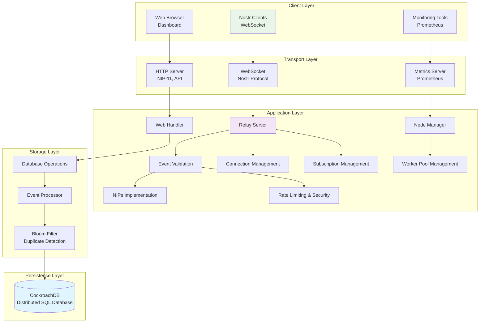
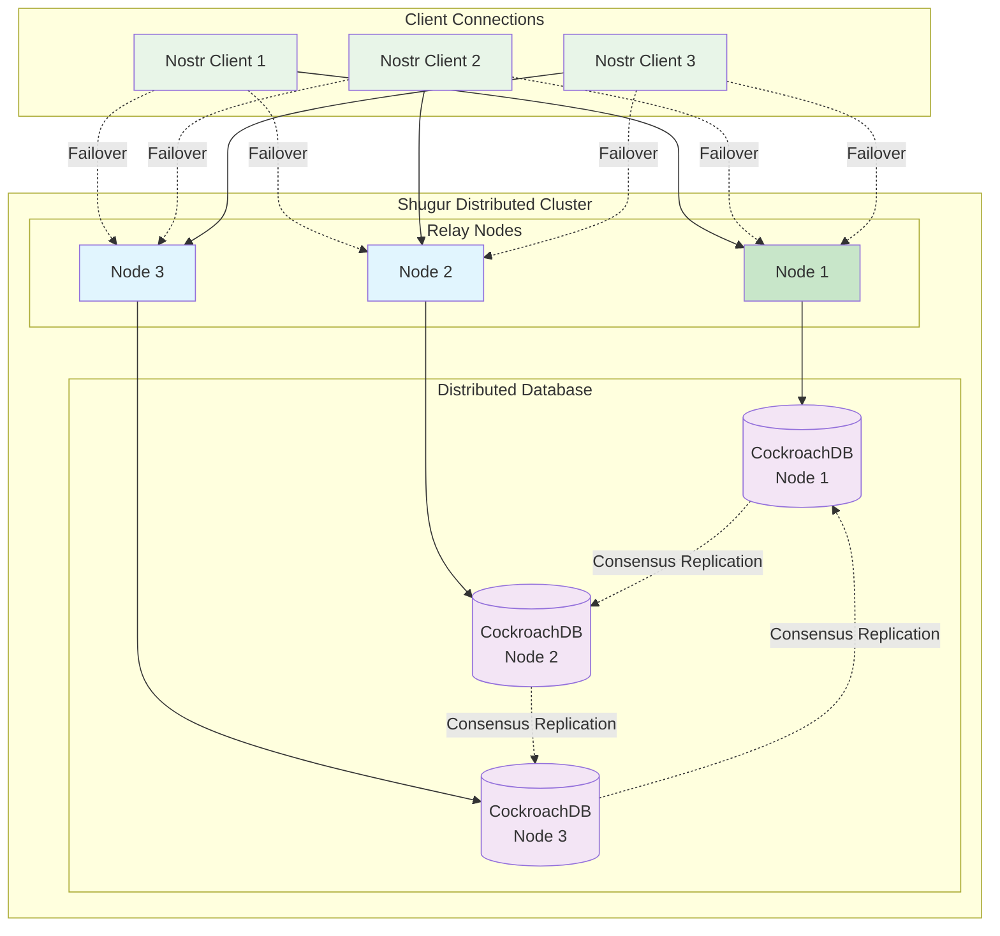
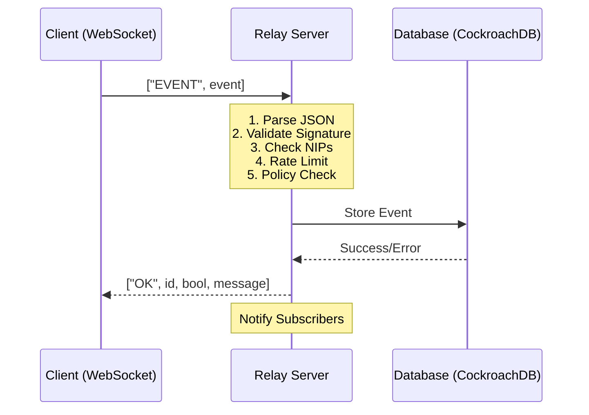
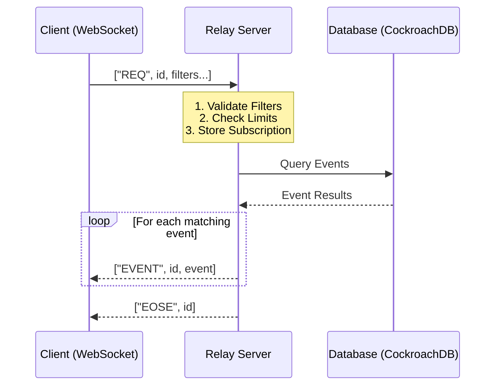
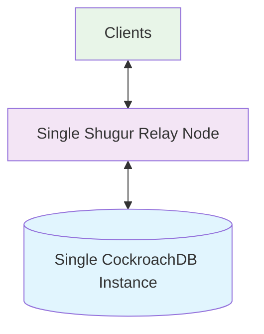
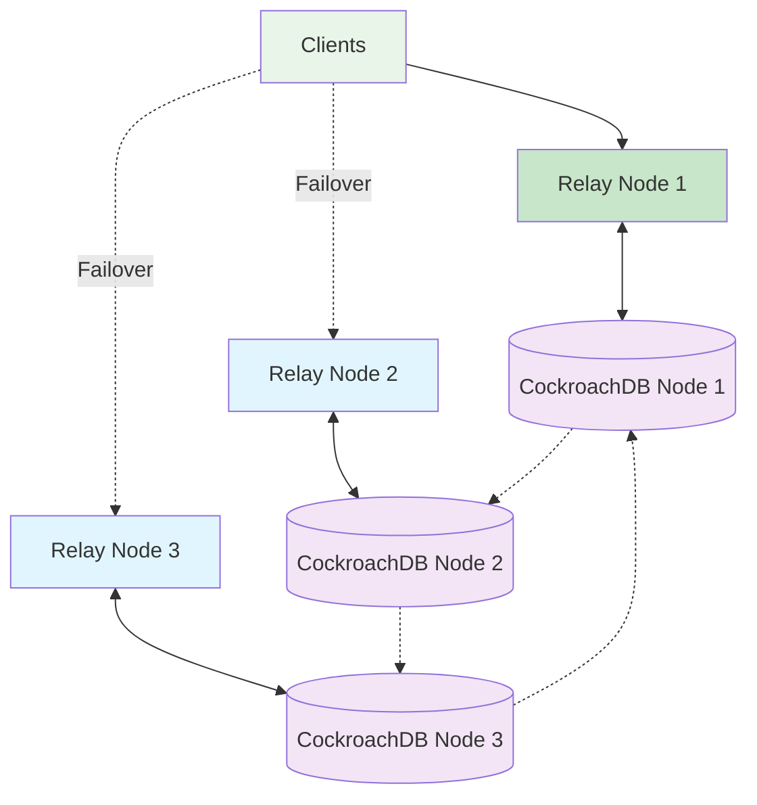

This document provides a detailed overview of Shugur Relay's technical architecture, design patterns, and implementation details.

## High-Level Architecture

Shugur Relay is designed as a **distributed relay cluster** that provides fault-tolerant, scalable Nostr infrastructure through a stateless, layered architecture. Clients connect directly to individual nodes in the cluster and handle failover themselves when nodes become unavailable.



## Distributed Cluster Architecture

### Cluster Overview

Shugur Relay operates as a distributed cluster where multiple relay nodes work together to provide high availability and data redundancy. This architecture ensures that:

- **Direct Node Access**: Clients connect directly to individual nodes in the cluster
- **Client-Side Failover**: When a node becomes unavailable, clients reconnect to other healthy nodes
- **Data Replication**: Events are automatically replicated across cluster nodes using CockroachDB's distributed consensus
- **Transparent Scaling**: New nodes can be added to the cluster, and clients can discover and connect to them



### Failover Behavior

1. **Health Monitoring**: Clients monitor connection health to their connected node
2. **Failure Detection**: Clients detect connection failures (network timeout, connection drop)
3. **Node Discovery**: Clients maintain a list of available cluster nodes
4. **Reconnection**: Clients reconnect to alternative nodes when failures occur
5. **Data Consistency**: All nodes serve the same data due to CockroachDB replication

### Benefits Over Traditional Multi-Relay Setup

| Traditional Nostr | Shugur Distributed Cluster |
|------------------|------------------|
| Client manages multiple connections | Client connects to cluster nodes |
| Manual failover logic required | Client handles failover between cluster nodes |
| Data scattered across relays | Unified data across cluster |
| Complex relay discovery | Cluster node discovery |
| Potential data inconsistency | Strong consistency via CockroachDB |

## Core Components

### 1. Application Node (`internal/application/`)

The central coordinator that manages all relay components.

**Responsibilities:**
- Component lifecycle management
- Dependency injection
- Configuration distribution
- Graceful shutdown coordination

**Key Files:**
- `node.go` - Main node implementation
- `node_builder.go` - Builder pattern for node construction
- `node_utils.go` - Utility functions

### 2. Relay Server (`internal/relay/`)

Handles the core Nostr protocol implementation.

**Responsibilities:**
- WebSocket connection management
- Nostr message processing
- Event validation and storage
- Subscription management

**Key Files:**
- `server.go` - HTTP/WebSocket server
- `connection.go` - WebSocket connection handling
- `subscription.go` - Subscription management
- `event_validator.go` - Event validation logic

### 3. Storage Layer (`internal/storage/`)

Manages data persistence and retrieval.

**Responsibilities:**
- Database connection management
- Event storage and retrieval
- Query optimization
- Bloom filter management

**Key Files:**
- `db.go` - Database connection and operations
- `event_processor.go` - Event processing pipeline
- `queries.go` - Database queries
- `schema.go` - Database schema management

### 4. NIPs Implementation (`internal/relay/nips/`)

Implements Nostr Improvement Proposals.

**Responsibilities:**
- Protocol compliance validation
- Event type specific processing
- Feature-specific logic

**Key Files:**
- `nip01.go` - Basic protocol flow
- `nip11.go` - Relay information document
- `nip17.go` - Private direct messages
- And many more NIP implementations...

## Design Patterns

### 1. Builder Pattern

Used for complex object construction, particularly the Node:

```go
type NodeBuilder struct {
    ctx     context.Context
    cfg     *config.Config
    privKey ed25519.PrivateKey
    // ... other fields
}

func (b *NodeBuilder) BuildDB() error { /* ... */ }
func (b *NodeBuilder) BuildWorkers() { /* ... */ }
func (b *NodeBuilder) Build() *Node { /* ... */ }
```

### 2. Interface Segregation

Components depend on interfaces rather than concrete implementations:

```go
type NodeInterface interface {
    RegisterConn(conn domain.WebSocketConnection)
    UnregisterConn(conn domain.WebSocketConnection)
    GetActiveConnectionCount() int64
    // ... other methods
}
```

### 3. Dependency Injection

Configuration and dependencies are injected through constructors:

```go
func NewServer(relayCfg config.RelayConfig, node domain.NodeInterface, fullCfg *config.Config) *Server
```

### 4. Worker Pool Pattern

Background task processing using worker pools:

```go
type WorkerPool struct {
    workers chan chan Job
    jobQueue chan Job
    quit chan bool
}
```

## Data Flow

### Event Processing Pipeline



### Subscription Flow



## Concurrency Model

### Goroutine Usage

1. **Main Server Goroutine** - HTTP server listener
2. **Connection Goroutines** - One per WebSocket connection
3. **Worker Pool Goroutines** - Background task processing
4. **Metrics Goroutines** - Metrics collection and export
5. **Database Pool Goroutines** - Connection pool management

### Synchronization Mechanisms

#### 1. Mutexes

Used for protecting shared state:

```go
type WsConnection struct {
    subscriptionsMu sync.RWMutex
    subscriptions   map[string]SubscriptionInfo
    // ...
}
```

#### 2. Channels

Used for communication between goroutines:

```go
type WorkerPool struct {
    jobQueue chan Job
    workers  chan chan Job
    quit     chan bool
}
```

#### 3. Atomic Operations

Used for counters and flags:

```go
type WsConnection struct {
    isClosed atomic.Bool
    // ...
}
```

## Storage Architecture

### Database Schema

```sql
-- Events table (main storage)
CREATE TABLE events (
    id TEXT PRIMARY KEY,
    pubkey TEXT NOT NULL,
    created_at BIGINT NOT NULL,
    kind INTEGER NOT NULL,
    tags JSONB,
    content TEXT,
    sig TEXT NOT NULL,
    
    INDEX idx_events_pubkey (pubkey),
    INDEX idx_events_kind (kind),
    INDEX idx_events_created_at (created_at),
    INDEX idx_events_tags (tags)
);

-- Additional indexes for performance
CREATE INDEX idx_events_composite ON events (kind, created_at);
CREATE INDEX idx_events_search ON events USING gin(to_tsvector('english', content));
```

### Query Optimization

#### 1. Bloom Filters

Used for quick duplicate detection:

```go
type DB struct {
    Bloom *bloom.BloomFilter
    // ...
}

// Check if event might exist
if !db.Bloom.TestString(eventID) {
    // Definitely new event
    return false
}
```

#### 2. Connection Pooling

Optimized database connection management:

```go
pool, err := pgxpool.New(ctx, dbURI)
```

#### 3. Prepared Statements

Cached query plans for better performance.

## Security Architecture

### Input Validation

#### 1. Event Validation Pipeline

```go
func (ev *EventValidator) ValidateEvent(event *nostr.Event) error {
    // 1. Structural validation
    if err := ev.validateStructure(event); err != nil {
        return err
    }
    
    // 2. Signature verification
    if err := ev.validateSignature(event); err != nil {
        return err
    }
    
    // 3. NIP-specific validation
    if err := ev.validateWithNIPs(event); err != nil {
        return err
    }
    
    return nil
}
```

#### 2. Rate Limiting

Token bucket algorithm implementation:

```go
type RateLimiter struct {
    limiters sync.Map // map[string]*rate.Limiter
}

func (rl *RateLimiter) Allow(key string) bool {
    limiter := rl.getLimiter(key)
    return limiter.Allow()
}
```

### Access Control

#### 1. Blacklist/Whitelist System

```go
type Node struct {
    blacklistPubKeys map[string]struct{}
    whitelistPubKeys map[string]struct{}
}
```

#### 2. Progressive Banning

Escalating penalties for policy violations.

## Performance Optimizations

### Memory Management

#### 1. Object Pooling

Reuse of frequently allocated objects:

```go
var eventPool = sync.Pool{
    New: func() interface{} {
        return &nostr.Event{}
    },
}
```

#### 2. Bloom Filter Usage

Reduces database queries for duplicate detection.

#### 3. Connection Caching

WebSocket connections are kept alive and reused.

### CPU Optimization

#### 1. Goroutine Pool

Limited number of worker goroutines to prevent resource exhaustion.

#### 2. Efficient JSON Processing

Optimized JSON parsing and generation.

#### 3. Signature Verification Caching

Cache results of expensive cryptographic operations.

## Deployment Models

### Standalone Deployment



- **Pros**: Simple to set up and manage
- **Cons**: Not highly available; single point of failure

### Distributed Deployment



- **Pros**: Highly available and horizontally scalable; tolerant to node failures; clients handle load distribution
- **Cons**: Clients need to implement failover logic; more complex client setup

## Monitoring and Observability

### Metrics Collection

#### 1. Prometheus Metrics

```go
var (
    EventsReceived = prometheus.NewCounterVec(
        prometheus.CounterOpts{
            Name: "relay_events_received_total",
            Help: "Total number of events received",
        },
        []string{"result"},
    )
)
```

#### 2. Structured Logging

```go
logger.Info("Event processed",
    zap.String("event_id", event.ID),
    zap.String("pubkey", event.PubKey),
    zap.Int("kind", event.Kind),
)
```

### Health Checks

#### 1. Database Health

Regular database connectivity checks.

#### 2. Memory Usage Monitoring

Track memory usage and garbage collection.

#### 3. Connection Metrics

Monitor active connections and connection rates.

## Error Handling

### Error Classification

#### 1. Validation Errors

Errors in event format or content:

```go
type ValidationError struct {
    Field   string
    Message string
}
```

#### 2. System Errors

Infrastructure or runtime errors:

```go
type SystemError struct {
    Component string
    Cause     error
}
```

### Error Recovery

#### 1. Circuit Breaker Pattern

Automatic fallback when dependencies fail.

#### 2. Graceful Degradation

Continue operating with reduced functionality.

#### 3. Retry Logic

Exponential backoff for transient failures.

## Scalability Considerations

### Horizontal Scaling

#### 1. Stateless Design

The relay can be horizontally scaled by running multiple instances.

#### 2. Database Clustering

CockroachDB provides built-in clustering capabilities.

#### 3. Load Balancing

WebSocket connections can be load balanced across instances.

### Vertical Scaling

#### 1. Resource Optimization

Efficient use of CPU, memory, and network resources.

#### 2. Connection Limits

Configurable limits based on available resources.

#### 3. Database Tuning

Optimized database configuration for the workload.

## Extension Points

### Plugin System (Future)

Architecture supports future plugin development:

```go
type Plugin interface {
    Init(ctx context.Context, cfg PluginConfig) error
    ProcessEvent(event *nostr.Event) error
    Shutdown() error
}
```

### Custom NIPs

New NIP implementations can be added easily:

```go
func RegisterNIP(kind int, validator func(*nostr.Event) error) {
    nipValidators[kind] = validator
}
```

### Custom Storage Backends

Storage layer can be extended with different backends.

## Related Documentation

- **[NIPs Support](/nips-support)**: Comprehensive NIP implementation details
- **[Configuration](/configuration)**: Configure your relay settings
- **[Performance Guide](/performance)**: Optimize for production workloads
- **[API Reference](/api)**: WebSocket and HTTP endpoint documentation
- **[Installation Guide](/installation)**: Choose your deployment method
