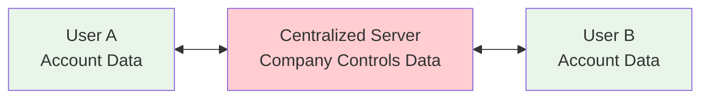
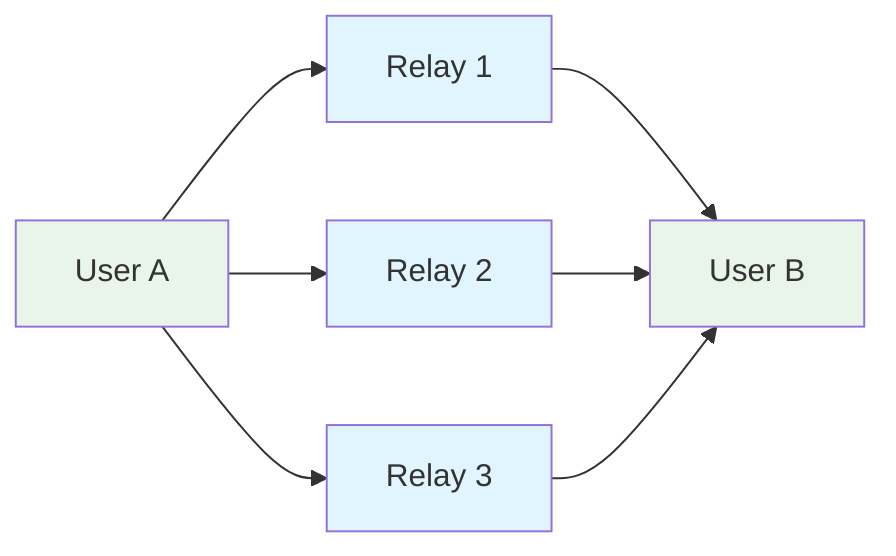
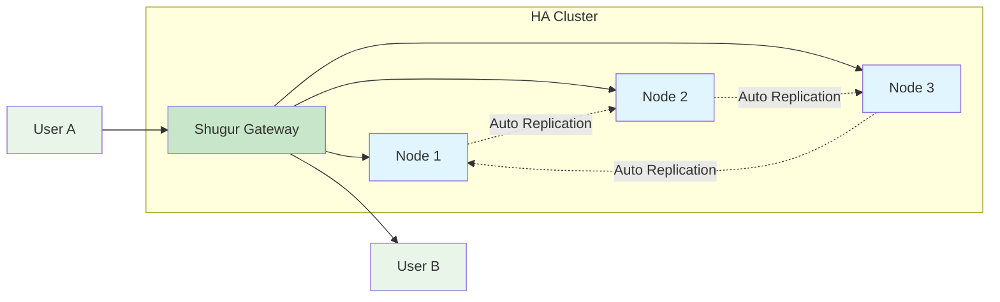

To understand the value of Nostr and Shugur Relay, it's helpful to look at the evolution of social media and information exchange protocols.

## The Journey to a Censorship-Resistant Protocol

### 1. The Traditional Model: Centralized Servers

Think of traditional social media platforms like Twitter or Facebook.

- How it works: Everything you post goes to a central server owned by a single company. Your identity, your data, and your ability to communicate are all controlled by that company.
- The Problem:
  - Censorship: The company can delete your posts, suspend your account, or shadow-ban you for any reason.
  - Single Point of Failure: If the company's servers go down, the entire platform is offline.
    - Data Control: The company owns your data and can sell it, analyze it, or lose it in a data breach.

### 2. The Blockchain Model: Decentralized but Complex

Blockchain platforms offered a solution to centralization.

- How it works: Instead of one server, data is stored on a distributed ledger across thousands of computers. No single entity has control. Transactions (or posts) are added to "blocks" and cannot be altered.
- The Solution: It solved the censorship and single-point-of-failure problems. No one can delete your data from the blockchain.
- The New Problems:
  - Scalability & Cost: Storing data on a blockchain is slow and expensive.
  - Immutability Issues: While tamper-proof storage sounds good, it means you can't delete mistakes, old content, or remove spam. Everything stays forever.

### 3. The Nostr Model: Simple Decentralization

Nostr takes a different approach: simple decentralization.

- How it works: Your identity is based on cryptographic keys (not accounts on a platform). You publish content to relays, which are servers that store and forward your messages. Traditionally, clients connect to multiple relays to fetch and display content.
- The Solution: No single point of control, no expensive blockchain transactions, users can delete or update content, and it's simple enough to build and run.

### 4. The Shugur Model: Distributed Relay Clusters

Shugur Relay takes Nostr decentralization further with **High Availability (HA) distributed relay clusters**.

- **How it works**: Instead of managing connections to multiple individual relays, users connect to a single Shugur Relay that represents an entire distributed cluster. Data is automatically replicated across multiple nodes in the network.
- **The Advantage**: 
  - **Simplified Connectivity**: Connect to one relay, access the entire cluster's data
  - **Automatic Failover**: If one relay node fails, your connection seamlessly continues through other nodes
  - **Data Persistence**: Your data exists across the network, not just on a single relay
  - **No Client-Side Complexity**: No need to manage multiple relay connections or handle failover logic

**Traditional Nostr Model**: Multiple relay connections

**Shugur Model**: Single connection to HA distributed cluster

## Key Nostr Concepts

### Federated Relays & The Outbox Model

Rather than all users connecting to one massive server, users connect to multiple relays. Each relay independently decides what content to store and serve. This creates a federated network.

**Shugur Simplification**: While traditional Nostr requires clients to manage multiple relay connections and implement the outbox model logic, Shugur's HA distributed cluster handles this complexity internally. Users get the benefits of federation (no single point of failure, distributed data) without the client-side complexity.

### Public Key Infrastructure (Identity)

Your identity in Nostr is a cryptographic key pair:

- Private Key: Only you know this. You use it to sign messages and prove you wrote them.
- Public Key: This is your identity. Anyone can use it to verify that messages came from you.

### Events (Content)

Everything in Nostr is an event: text notes, reactions, DMs, profile info, follow lists. Each event is signed, so it can be verified as authentic.

## Related Documentation

- Architecture: Understand how Shugur Relay implements these concepts
- Installation Guide: Set up your own relay
- Configuration Guide: Customize your relay's behavior
- API Reference: Technical details for developers
