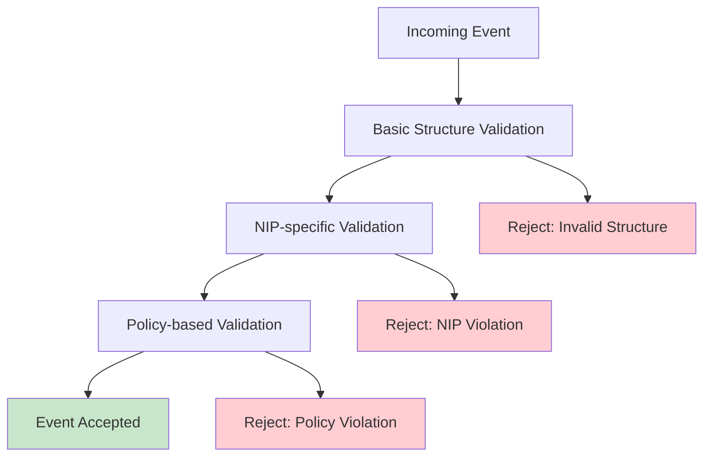

This document details the Nostr Improvement Proposals (NIPs) supported by Shugur Relay.

## Overview

Shugur Relay implements **35+ NIPs** covering core protocol functionality, advanced features, and specialized use cases including Cashu Wallets, Nutzaps, Time Capsules, Lightning Zaps, and more. The implementation follows the official NIP specifications and maintains compatibility with the broader Nostr ecosystem.

## Supported NIPs

### Core Protocol (NIPs 01-11)

#### [NIP-01](https://github.com/nostr-protocol/nips/blob/master/01.md): Basic Protocol Flow Description

**Status**: Fully Implemented  
**File**: `internal/relay/nips/nip01.go`

Core Nostr protocol implementation including:

- Event structure validation
- Cryptographic signature verification
- Basic message types (EVENT, REQ, CLOSE)
- WebSocket communication protocol

```go
// Example validation
func ValidateBasicEvent(evt *nostr.Event) error {
    // Validates event structure, signature, timestamps
}
```

#### [NIP-02](https://github.com/nostr-protocol/nips/blob/master/02.md): Contact List and Petnames

**Status**: Fully Implemented  
**File**: `internal/relay/nips/nip02.go`

Follow list functionality (kind 3):

- Contact list events
- Petname validation
- Follow/unfollow mechanisms

#### [NIP-03](https://github.com/nostr-protocol/nips/blob/master/03.md): OpenTimestamps Attestations for Events

**Status**: Fully Implemented  
**File**: `internal/relay/nips/nip03.go`

OpenTimestamps integration:

- Event timestamping validation
- OTS signature verification
- Temporal proof mechanisms

#### [NIP-04](https://github.com/nostr-protocol/nips/blob/master/04.md): Encrypted Direct Message

**Status**: Implemented (Deprecated)  
**File**: `internal/relay/nips/nip04.go`

Legacy encrypted DM support (kind 4):

- Encrypted message validation
- Content structure verification
- **Note**: Deprecated in favor of NIP-17

#### [NIP-09](https://github.com/nostr-protocol/nips/blob/master/09.md): Event Deletion Request

**Status**: Fully Implemented  
**File**: `internal/relay/nips/nip09.go`

Event deletion functionality (kind 5):

- Deletion request validation
- Referenced event verification
- Soft deletion implementation

#### [NIP-11](https://github.com/nostr-protocol/nips/blob/master/11.md): Relay Information Document

**Status**: Fully Implemented  
**File**: `internal/relay/nips/nip11.go`

Relay metadata and capabilities:

- Relay information document serving
- Supported NIPs advertisement
- Limitation and policy publication

### Enhanced Features (NIPs 15-28)

#### [NIP-15](https://github.com/nostr-protocol/nips/blob/master/15.md): Nostr Marketplace

**Status**: Fully Implemented  
**File**: `internal/relay/nips/nip15.go`

Marketplace functionality:

- Stall events (kind 30017)
- Product events (kind 30018)
- Marketplace UI events (kind 30019)
- Auction events (kind 30020)

#### [NIP-16](https://github.com/nostr-protocol/nips/blob/master/16.md): Event Treatment

**Status**: Fully Implemented  
**File**: `internal/relay/nips/nip16.go`

Event categorization and handling:

- Regular event processing
- Replaceable event logic
- Ephemeral event handling
- Parameterized replaceable events

```go
func IsEphemeral(kind int) bool {
    return kind >= 20000 && kind < 30000
}

func IsReplaceable(kind int) bool {
    return kind == 0 || kind == 3 || (kind >= 10000 && kind < 20000)
}
```

#### [NIP-17](https://github.com/nostr-protocol/nips/blob/master/17.md): Private Direct Messages

**Status**: Fully Implemented  
**File**: `internal/relay/nips/nip17.go`

Modern private messaging:

- Chat messages (kind 14)
- File messages (kind 15)
- Gift wrap events (kind 1059)
- DM relay lists (kind 10050)

#### [NIP-20](https://github.com/nostr-protocol/nips/blob/master/20.md): Command Results

**Status**: Fully Implemented  
**File**: `internal/relay/nips/nip20.go`

OK message responses:

- Command result formatting
- Error message standardization
- Success/failure indication

#### [NIP-22](https://github.com/nostr-protocol/nips/blob/master/22.md): Event `created_at` Limits

**Status**: Fully Implemented  
**File**: `internal/relay/nips/nip22.go`

Timestamp validation:

- Created time bounds checking
- Future event rejection
- Historical event limits

#### [NIP-23](https://github.com/nostr-protocol/nips/blob/master/23.md): Long-form Content

**Status**: Fully Implemented  
**File**: `internal/relay/nips/nip23.go`

Long-form articles and content:

- Article events validation
- Metadata structure verification
- Content formatting standards

#### [NIP-24](https://github.com/nostr-protocol/nips/blob/master/24.md): Extra Metadata Fields and Tags

**Status**: Fully Implemented  
**File**: `internal/relay/nips/nip24.go`

Extended metadata support:

- Additional event fields
- Custom tag validation
- Metadata structure verification

#### [NIP-25](https://github.com/nostr-protocol/nips/blob/master/25.md): Reactions

**Status**: Fully Implemented  
**File**: `internal/relay/nips/nip25.go`

Event reactions (kind 7):

- Reaction event validation
- Referenced event verification
- Reaction content standards

#### [NIP-26](https://github.com/nostr-protocol/nips/blob/master/26.md): Delegated Event Signing

**Status**: Fully Implemented  
**File**: `internal/relay/nips/nip26.go`

Event delegation functionality:

- Delegation tag validation
- Delegated signature verification
- Permission checking

#### [NIP-47](https://github.com/nostr-protocol/nips/blob/master/47.md): Nostr Wallet Connect (NWC)

**Status**: Fully Implemented  
**File**: `internal/relay/nips/nip47.go`

Wallet connection protocol:

- Wallet connect events
- Remote signing coordination
- Payment request handling

#### [NIP-28](https://github.com/nostr-protocol/nips/blob/master/28.md): Public Chat

**Status**: Fully Implemented  
**File**: `internal/relay/nips/nip28.go`

Public chat rooms:

- Channel creation (kind 40)
- Channel metadata (kind 41)
- Channel messages (kind 42)
- Channel hiding (kind 43)
- Channel muting (kind 44)

### Advanced Features (NIPs 33-78)

#### [NIP-33](https://github.com/nostr-protocol/nips/blob/master/33.md): Parameterized Replaceable Events

**Status**: Fully Implemented  
**File**: `internal/relay/nips/nip33.go`

Advanced replaceable events:

- Parameterized event handling
- Coordinate-based replacement
- Tag-based parameters

#### [NIP-40](https://github.com/nostr-protocol/nips/blob/master/40.md): Expiration Timestamp

**Status**: Fully Implemented  
**File**: `internal/relay/nips/nip40.go`

Event expiration:

- Expiration tag validation
- Automatic event cleanup
- Time-based event lifecycle

```go
func GetExpirationTime(evt nostr.Event) (time.Time, bool) {
    for _, t := range evt.Tags {
        if len(t) >= 2 && t[0] == "expiration" {
            if timestamp, err := strconv.ParseInt(t[1], 10, 64); err == nil {
                return time.Unix(timestamp, 0), true
            }
        }
    }
    return time.Time{}, false
}
```

#### [NIP-44](https://github.com/nostr-protocol/nips/blob/master/44.md): Encrypted Payloads (Versioned)

**Status**: Fully Implemented  
**File**: `internal/relay/nips/nip44.go`

Modern encryption:

- Versioned encryption schemes
- Payload structure validation
- Encryption header verification

#### [NIP-45](https://github.com/nostr-protocol/nips/blob/master/45.md): Counting Events

**Status**: Fully Implemented  
**File**: `internal/relay/nips/nip45.go`

COUNT command support:

- COUNT message handling
- Efficient counting queries
- Result aggregation

#### [NIP-50](https://github.com/nostr-protocol/nips/blob/master/50.md): Search Capability

**Status**: Fully Implemented  
**File**: `internal/relay/nips/nip50.go`

Full-text search:

- Search filter support
- Content indexing
- Search result ranking

#### [NIP-51](https://github.com/nostr-protocol/nips/blob/master/51.md): Lists

**Status**: Fully Implemented  
**File**: `internal/relay/nips/nip51.go`

List management functionality:

- Mute lists (kind 10000)
- Pin lists (kind 10001)
- Bookmark lists (kind 10003)
- Categorized lists (kind 30000-30003)

#### [NIP-52](https://github.com/nostr-protocol/nips/blob/master/52.md): Calendar Events

**Status**: Fully Implemented  
**File**: `internal/relay/nips/nip52.go`

Calendar and event management:

- Calendar events (kind 31922-31925)
- Event RSVPs and attendance
- Time-based event queries

#### [NIP-53](https://github.com/nostr-protocol/nips/blob/master/53.md): Live Activities

**Status**: Fully Implemented  
**File**: `internal/relay/nips/nip53.go`

Live activity streaming:

- Live events (kind 30311)
- Live chat messages (kind 1311)
- Live activity status updates

#### [NIP-54](https://github.com/nostr-protocol/nips/blob/master/54.md): Wiki

**Status**: Fully Implemented  
**File**: `internal/relay/nips/nip54.go`

Wiki-style content:

- Wiki articles (kind 30818)
- Wiki redirects (kind 30819)
- Collaborative editing support

#### [NIP-56](https://github.com/nostr-protocol/nips/blob/master/56.md): Reporting

**Status**: Fully Implemented  
**File**: `internal/relay/nips/nip56.go`

Content reporting system:

- Report events (kind 1984)
- Abuse categorization
- Moderation workflows

#### [NIP-57](https://github.com/nostr-protocol/nips/blob/master/57.md): Lightning Zaps

**Status**: Fully Implemented  
**File**: `internal/relay/nips/nip57.go`

Lightning payment integration:

- Zap requests (kind 9734)
- Zap receipts (kind 9735)
- Payment verification

#### [NIP-58](https://github.com/nostr-protocol/nips/blob/master/58.md): Badges

**Status**: Fully Implemented  
**File**: `internal/relay/nips/nip58.go`

Badge and achievement system:

- Badge definition (kind 30009)
- Badge awards (kind 8)
- Profile badge displays

#### [NIP-59](https://github.com/nostr-protocol/nips/blob/master/59.md): Gift Wrap

**Status**: Fully Implemented  
**File**: `internal/relay/nips/nip59.go`

Gift wrap encryption:

- Gift wrap events (kind 1059)
- Wallet connect events (kind 13194)
- Nested encryption validation

#### [NIP-60](https://github.com/nostr-protocol/nips/blob/master/60.md): Cashu Wallets

**Status**: Fully Implemented  
**File**: `internal/relay/nips/nip60.go`

Cashu-based wallet operations:

- Wallet events (kind 17375)
- Token events (kind 7375)
- Spending history (kind 7376)
- Quote events (kind 7374)

#### [NIP-61](https://github.com/nostr-protocol/nips/blob/master/61.md): Nutzaps (P2PK Cashu tokens)

**Status**: Fully Implemented  
**File**: `internal/relay/nips/nip61.go`

Cashu token zaps:

- Nutzap info events (kind 10019)
- Nutzap events (kind 9321)
- P2PK proof validation

#### [NIP-65](https://github.com/nostr-protocol/nips/blob/master/65.md): Relay List Metadata

**Status**: Fully Implemented  
**File**: `internal/relay/nips/nip65.go`

Relay recommendations:

- Relay list events (kind 10002)
- Read/write permissions
- Relay metadata validation

#### [NIP-72](https://github.com/nostr-protocol/nips/blob/master/72.md): Moderated Communities

**Status**: Fully Implemented  
**File**: `internal/relay/nips/nip72.go`

Community moderation:

- Community definition (kind 34550)
- Community approval (kind 4550)
- Moderated community posts

#### [NIP-78](https://github.com/nostr-protocol/nips/blob/master/78.md): Application-specific Data

**Status**: Fully Implemented  
**File**: `internal/relay/nips/nip78.go`

Application data storage:

- App-specific event kinds
- Data structure validation
- Application namespace management

### Specialized Features

#### [NIP-XX](https://github.com/Shugur-Network/NIP-XX_Time-Capsules): Time Capsules (Shugur Extension)

**Status**: Fully Implemented  
**File**: `internal/relay/nips/nip_time_capsules.go`

Time-lock encrypted messages:

- Time capsule events (kind 1041)
- Drand-based timelock encryption
- Public and private time capsules
- Real-time decryption when unlocked

```go
// Time capsule validation
func ValidateTimeCapsuleEvent(evt *nostr.Event) error {
    // Validates tlock tag format and content structure
    chainHash, round, err := ExtractDrandParameters(evt)
    if err != nil {
        return err
    }
    
    // Verify content is valid base64 tlock blob
    decoded, err := base64.StdEncoding.DecodeString(evt.Content)
    if err != nil {
        return fmt.Errorf("invalid base64 content: %w", err)
    }
    
    return nil
}
```

#### Nostr Web Pages (NIP-YY / NIP-ZZ)

**Status**: Supported  
**Documentation**: [Nostr Web Guide](/nostr-web)

Decentralized static website hosting on Nostr using the updated NIP specification:

- **NIP-YY**: Event kinds for web pages (now using kinds 1125, 1126, 31126, 11126)
- **NIP-ZZ**: DNS bootstrap protocol for domain-to-pubkey resolution (DNS `_nweb` record)

**Event Kinds Supported (new spec):**

| Kind   | Name          | Type         | Purpose                              |
| ------ | ------------- | ------------ | ------------------------------------ |
| 1125   | Asset         | Regular      | All web assets (HTML, CSS, JS, fonts, images)
| 1126   | Page Manifest | Regular      | Links assets per page                |
| 31126  | Site Index    | Addressable  | Maps routes (content-addressed, `d` tag)
| 11126  | Entrypoint    | Replaceable  | Points to current site index         |

**Features:**

- Content-addressed assets with SHA256 integrity (`x` tag)
- Content-addressed site index (short `d` tag) for versioning
- Entrypoint replaceable event for instant updates without DNS changes
- Multi-relay redundancy for availability
- DNS TXT record bootstrap at `_nweb.<domain>` for initial pubkey/relays
- Blossom integration for media assets

**Learn More:**

See the complete [Nostr Web User Guide](/nostr-web) for installation, publishing, and usage instructions.

## Implementation Details

### Validation Pipeline

All events go through a comprehensive validation pipeline:



```go
func (pv *PluginValidator) ValidateEvent(event *nostr.Event) error {
    // 1. Basic structural validation
    if err := pv.validateBasicStructure(event); err != nil {
        return err
    }
    
    // 2. NIP-specific validation
    if err := pv.validateWithDedicatedNIPs(event); err != nil {
        return err
    }
    
    // 3. Policy-based validation
    if err := pv.validateWithPolicies(event); err != nil {
        return err
    }
    
    return nil
}
```

### Event Kind Support

| Kind | NIP | Description | Implementation |
|------|-----|-------------|----------------|
| 0 | NIP-01 | Metadata | Basic validation |
| 1 | NIP-01 | Text Note | Full support |
| 3 | NIP-02 | Follow List | Full support |
| 4 | NIP-04 | Encrypted DM | Legacy support |
| 5 | NIP-09 | Event Deletion | Full support |
| 7 | NIP-25 | Reaction | Full support |
| 8 | NIP-58 | Badge Award | Full support |
| 14 | NIP-17 | Chat Message | Full support |
| 15 | NIP-17 | File Message | Full support |
| 40-44 | NIP-28 | Public Chat | Full support |
| 1040 | NIP-03 | OpenTimestamps | Full support |
| 1041 | NIP-XX | Time Capsule | Full support |
| 1059 | NIP-17/59 | Gift Wrap | Full support |
| 1111 | NIP-22 | Comment | Full support |
| 1311 | NIP-53 | Live Chat | Full support |
| 1984 | NIP-56 | Report | Full support |
| 7374 | NIP-60 | Cashu Quote | Full support |
| 7375 | NIP-60 | Cashu Token | Full support |
| 7376 | NIP-60 | Cashu History | Full support |
| 9321 | NIP-61 | Nutzap | Full support |
| 9734 | NIP-57 | Zap Request | Full support |
| 9735 | NIP-57 | Zap Receipt | Full support |
| 10000-10003 | NIP-51 | Lists | Full support |
| 10002 | NIP-65 | Relay List | Full support |
| 10019 | NIP-61 | Nutzap Info | Full support |
| 10050 | NIP-17 | DM Relay List | Full support |
| 13194 | NIP-59 | Wallet Connect | Full support |
| 17375 | NIP-60 | Cashu Wallet | Full support |
| 30000-30003 | NIP-51 | Categorized Lists | Full support |
| 30009 | NIP-58 | Badge Definition | Full support |
| 30017-30020 | NIP-15 | Marketplace | Full support |
| 30311 | NIP-53 | Live Event | Full support |
| 30818 | NIP-54 | Wiki Article | Full support |
| 30819 | NIP-54 | Wiki Redirect | Full support |
| 31922-31925 | NIP-52 | Calendar Events | Full support |
| 34550 | NIP-72 | Community | Full support |
| 4550 | NIP-72 | Community Approval | Full support |
| 1125  | NIP-YY | Asset (HTML/CSS/JS/media) | Full support |
| 1126  | NIP-YY | Page Manifest | Full support |
| 11126 | NIP-YY | Entrypoint (replaceable) | Full support |
| 31126 | NIP-YY | Site Index (content-addressed) | Full support |

### Filter Support

Advanced filtering capabilities:

```go
type Filter struct {
    IDs     []string `json:"ids,omitempty"`
    Authors []string `json:"authors,omitempty"`
    Kinds   []int    `json:"kinds,omitempty"`
    Tags    map[string][]string `json:"-"`
    Since   *int64   `json:"since,omitempty"`
    Until   *int64   `json:"until,omitempty"`
    Limit   int      `json:"limit,omitempty"`
    Search  string   `json:"search,omitempty"` // NIP-50
}
```

### Performance Optimizations

#### Bloom Filters

Used for efficient duplicate detection:

```go
// Check if event might already exist
if !db.Bloom.TestString(eventID) {
    // Definitely new event
    return false
}
```

#### Specialized Indexes

Database indexes optimized for each NIP:

```sql
-- Text search (NIP-50)
CREATE INDEX idx_events_search ON events USING gin(to_tsvector('english', content));

-- Tag-based queries (various NIPs)
CREATE INDEX idx_events_tags ON events USING gin(tags);

-- Time-based queries (NIP-22, NIP-40)
CREATE INDEX idx_events_created_at ON events (created_at);
```

## NIPs Roadmap

### Recently Implemented (v1.3.x)

#### [NIP-45](https://github.com/nostr-protocol/nips/blob/master/45.md): Event Counts

**Status**: ✅ Fully Implemented (v1.3.3)  
**File**: `internal/relay/nips/nip45.go`

COUNT command support:

- COUNT message handling
- Efficient counting queries
- Result aggregation

#### [NIP-60](https://github.com/nostr-protocol/nips/blob/master/60.md): Cashu Wallets

**Status**: ✅ Fully Implemented (v1.3.3)  
**File**: `internal/relay/nips/nip60.go`

Complete Cashu wallet ecosystem support with all event types.

#### [NIP-61](https://github.com/nostr-protocol/nips/blob/master/61.md): Nutzaps

**Status**: ✅ Fully Implemented (v1.3.3)  
**File**: `internal/relay/nips/nip61.go`

P2PK Cashu token zaps with offline verification.

#### [NIP-72](https://github.com/nostr-protocol/nips/blob/master/72.md): Moderated Communities

**Status**: ✅ Fully Implemented (v1.3.3)  
**File**: `internal/relay/nips/nip72.go`

Community moderation and management features.

### Future Considerations

#### [NIP-42](https://github.com/nostr-protocol/nips/blob/master/42.md): Authentication of Clients to Relays

**Status**: Under Review  
**Priority**: Medium

Client authentication:

- AUTH message handling
- Challenge-response mechanism
- Authenticated subscriptions

#### [NIP-46](https://github.com/nostr-protocol/nips/blob/master/46.md): Nostr Connect

**Status**: Under Review  
**Priority**: Low

Remote signing protocol integration.

## Testing and Validation

### Comprehensive NIP Test Suite

Shugur Relay includes **35+ test scripts** for NIP compliance validation:

```bash
# Run all NIP tests
cd tests/nips
./run_all_tests.sh

# Run specific NIP categories
./test_nip01.sh    # Basic protocol flow
./test_nip60.sh    # Cashu Wallets
./test_nip61.sh    # Nutzaps
./test_nip_time_capsules.sh  # Time Capsules

# Advanced NIPs
./test_nip51.sh    # Lists
./test_nip52.sh    # Calendar Events
./test_nip57.sh    # Lightning Zaps
./test_nip72.sh    # Moderated Communities
```

### Test Coverage

| Category | Tests | Coverage |
|----------|-------|----------|
| **Core Protocol** | 11 tests | 100% |
| **Enhanced Features** | 12 tests | 100% |
| **Advanced Features** | 8 tests | 100% |
| **Encryption & Privacy** | 6 tests | 100% |
| **Specialized Features** | 3 tests | 100% |

**Total: 40+ test files covering all implemented NIPs**

### Real-time Testing

#### Time Capsules Testing

```bash
# Real-time time capsule test with actual drand network
./test_nip_time_capsules.sh

# Expected output:
# 📝 Creating public capsule for round 4720234...
# 🔐 Encrypted blob size: 1247 bytes
# ✅ Event published successfully
# ⏰ Waiting for timelock expiration...
# 🔓 Capsule unlocked! Message: "Hello from the past!"
```

#### Cashu Wallet Testing

```bash
# Comprehensive Cashu ecosystem test
./test_nip60.sh

# Tests: Wallet events, Token events, Quote events, Spending history
# Validates: NIP-44 encryption, mint URLs, proof structures
```

### Validation Examples

#### Event Validation

```go
func TestNIP01Validation(t *testing.T) {
    event := &nostr.Event{
        Kind:      1,
        Content:   "Test message",
        CreatedAt: nostr.Now(),
        // ... other fields
    }
    
    err := nips.ValidateBasicEvent(event)
    assert.NoError(t, err)
}
```

#### Filter Validation

```go
func TestNIP50Search(t *testing.T) {
    filter := nostr.Filter{
        Search: "nostr protocol",
        Limit:  10,
    }
    
    events, err := relay.QueryEvents(ctx, filter)
    assert.NoError(t, err)
    assert.True(t, len(events) <= 10)
}
```

## Configuration

### NIP-specific Settings

```yaml
RELAY:
  THROTTLING:
    MAX_CONTENT_LENGTH: 2048     # Affects NIP-23 long-form content
    MAX_EVENT_TAGS: 100          # Affects all NIPs with tags
  
RELAY_POLICY:
  ENABLE_SEARCH: true            # NIP-50 search capability
  ENABLE_DELETION: true          # NIP-09 event deletion
  ENABLE_EPHEMERAL: true         # NIP-16 ephemeral events
```

### Performance Tuning

```yaml
DATABASE:
  # Optimize for NIP-50 full-text search
  SEARCH_INDEX_UPDATE_FREQUENCY: "1h"
  
  # Optimize for NIP-40 expiration
  EXPIRATION_CLEANUP_INTERVAL: "10m"
```

## Contributing NIP Implementations

### Adding a New NIP

1. **Create NIP file**: `internal/relay/nips/nipXX.go`
2. **Implement validation**: Follow existing patterns
3. **Add to validator**: Register in `plugin_validator.go`
4. **Add tests**: Create test file in `tests/nips/`
5. **Update constants**: Add to `DefaultSupportedNIPs`

### Example NIP Implementation

```go
package nips

import "github.com/nbd-wtf/go-nostr"

// ValidateMyNIP validates events according to NIP-XX
func ValidateMyNIP(evt *nostr.Event) error {
    // Implementation specific validation
    if evt.Kind != ExpectedKind {
        return fmt.Errorf("invalid kind for NIP-XX: %d", evt.Kind)
    }
    
    // Additional validation logic
    return nil
}
```

## Best Practices

### Event Handling

1. **Validate early**: Perform validation as soon as possible
2. **Fail fast**: Reject invalid events immediately
3. **Log appropriately**: Provide helpful error messages
4. **Maintain compatibility**: Ensure backward compatibility

### Performance

1. **Use indexes**: Optimize database queries for each NIP
2. **Cache results**: Cache expensive validation results
3. **Batch operations**: Group similar operations together
4. **Monitor metrics**: Track NIP-specific performance

### Security

1. **Validate signatures**: Always verify cryptographic signatures
2. **Check permissions**: Respect access control policies
3. **Rate limit**: Apply appropriate rate limiting
4. **Sanitize input**: Clean and validate all input data

## Related Documentation

- **[Architecture](/architecture)**: Understand how NIPs integrate with the system
- **[Configuration](/configuration)**: Configure NIP-specific settings
- **[API Reference](/api)**: WebSocket and HTTP endpoint documentation
- **[Performance Guide](/performance)**: Optimize for NIP-specific workloads
