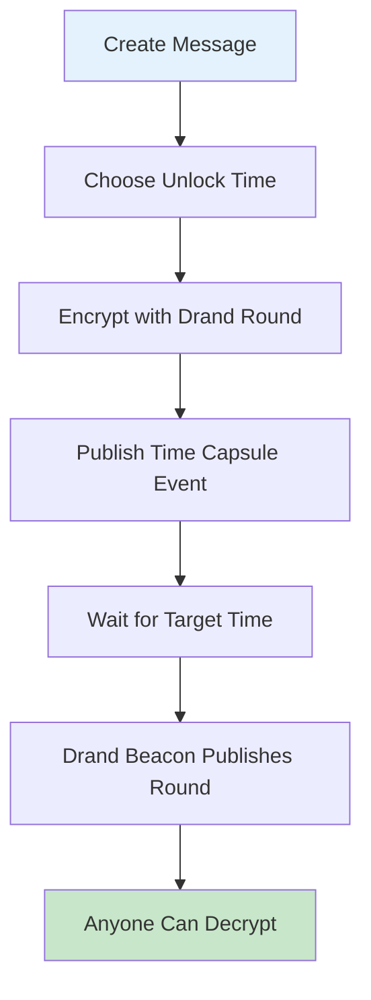

Time Capsules are time-lock encrypted messages that can only be decrypted after a specific time. This feature implements NIP-XX Time Capsules specification with real drand network integration for decentralized timelock functionality.

## Overview

Time Capsules allow you to create messages that remain encrypted until a predetermined time in the future. Unlike traditional encryption where you control the key, time capsules use the drand randomness beacon network to ensure messages can only be decrypted when the specified time arrives.

### Key Features

- **Decentralized Timelock**: Uses drand randomness beacon network
- **Two Modes**: Public time capsules (kind 1041) and private gift-wrapped capsules
- **Real Encryption**: Uses age v1 format with tlock recipients
- **NIP-44 Integration**: Modern encryption for private capsules
- **NIP-59 Gift Wrapping**: Private delivery mechanism

## How It Works



### Drand Integration

Time Capsules use the [drand](https://drand.love) randomness beacon network:

- **Quicknet**: 3-second rounds for precise timing
- **Mainnet**: Production-ready randomness beacon
- **Verifiable**: Cryptographically verifiable randomness
- **Decentralized**: No single point of failure

## Event Structure

### Public Time Capsules (Kind 1041)

```json
{
  "kind": 1041,
  "content": "base64_encoded_tlock_blob",
  "tags": [
    ["tlock", "drand_chain_hash", "drand_round"],
    ["alt", "Time capsule: unlock at 2025-12-25 12:00:00 UTC"]
  ],
  "created_at": 1704034800,
  "pubkey": "author_pubkey"
}
```

### Private Time Capsules (Gift Wrapped)

Private time capsules use NIP-59 gift wrapping for targeted delivery:

```json
{
  "kind": 1059,
  "content": "nip44_encrypted_wrapper",
  "tags": [
    ["p", "recipient_pubkey"]
  ],
  "created_at": 1704034800,
  "pubkey": "ephemeral_pubkey"
}
```

The inner event (kind 1041) contains the actual time capsule.

## Tag Specifications

### tlock Tag Format

```
["tlock", "<drand_chain_hex64>", "<drand_round_uint>"]
```

- **drand_chain_hex64**: 64-character hex chain hash
- **drand_round_uint**: Positive integer round number

### Supported Drand Networks

| Network | Chain Hash | Period | Description |
|---------|------------|--------|-------------|
| Quicknet | `52db9ba70e0cc0f6eaf7803dd07447a1f5477735fd3f661792ba94600c84e971` | 3s | Fast rounds |
| Mainnet | `8990e7a9aaed2ffed73dbd7092123d6f289930540d7651336225dc172e51b2ce` | 30s | Stable production |

## Creating Time Capsules

### Using nak (Command Line)

```bash
# Install dependencies
go install github.com/drand/tlock/cmd/tle@latest
go install github.com/fiatjaf/nak@latest

# Create a public time capsule
echo "Hello from the past!" | tle encrypt --chain quicknet --round 4720500 | \
  nak event -k 1041 -t tlock=52db9ba70e0cc0f6eaf7803dd07447a1f5477735fd3f661792ba94600c84e971=4720500 \
  -t alt="Time capsule: unlock at 2025-12-25 12:00:00 UTC" wss://relay.example.com
```

### Using the Test Suite

```bash
# Run comprehensive time capsule tests
cd tests/nips
./test_nip_time_capsules.sh

# Expected output:
# 🕐 Testing NIP-XX Time Capsules Implementation
# 📝 Creating public capsule for round 4720234...
# ✅ Public capsule created and published
# 📝 Creating private capsule...
# ✅ Private capsule created and published
# 🎉 All tests passed!
```

### Python Integration

```python
#!/usr/bin/env python3
import json
import subprocess
import time
from datetime import datetime, timedelta

class TimeCapsuleCreator:
    def __init__(self, relay_url="wss://relay.example.com"):
        self.relay_url = relay_url
        self.quicknet_hash = "52db9ba70e0cc0f6eaf7803dd07447a1f5477735fd3f661792ba94600c84e971"
    
    def create_capsule(self, message, unlock_time):
        """Create a time capsule that unlocks at specified time"""
        
        # Calculate target round (quicknet has 3-second rounds)
        current_time = int(time.time())
        time_diff = unlock_time - current_time
        current_round = self.get_current_round()
        target_round = current_round + (time_diff // 3)
        
        # Encrypt with tlock
        tlock_blob = self.tlock_encrypt(message, target_round)
        
        # Create event
        event = {
            "kind": 1041,
            "content": tlock_blob,
            "tags": [
                ["tlock", self.quicknet_hash, str(target_round)],
                ["alt", f"Time capsule: unlock at {datetime.fromtimestamp(unlock_time)}"]
            ]
        }
        
        return self.publish_event(event)
    
    def tlock_encrypt(self, message, round_number):
        """Encrypt message using tlock"""
        cmd = [
            "tle", "encrypt", 
            "--chain", "quicknet",
            "--round", str(round_number)
        ]
        
        result = subprocess.run(
            cmd, 
            input=message.encode(), 
            capture_output=True
        )
        
        if result.returncode != 0:
            raise Exception(f"Encryption failed: {result.stderr}")
            
        return result.stdout.decode().strip()

# Usage example
creator = TimeCapsuleCreator()
unlock_time = int(time.time()) + 3600  # 1 hour from now
creator.create_capsule("Secret message!", unlock_time)
```

## Decrypting Time Capsules

### Automatic Decryption

Once the target drand round is published, anyone can decrypt the time capsule:

```bash
# Get the time capsule content (base64 tlock blob)
TLOCK_BLOB="AgAaP1234..."  # From event content

# Decrypt using tlock
echo "$TLOCK_BLOB" | base64 -d | tle decrypt --chain quicknet
```

### Verification Process

1. **Fetch Event**: Get the time capsule event from relay
2. **Extract Parameters**: Parse tlock tag for chain and round
3. **Check Round Status**: Verify if drand round is published
4. **Decrypt**: Use tlock to decrypt the content

```bash
# Check if round is available
curl -s "https://api.drand.sh/52db9ba70e0cc0f6eaf7803dd07447a1f5477735fd3f661792ba94600c84e971/public/4720500" | jq .

# If available, decrypt
echo "$TLOCK_BLOB" | base64 -d | tle decrypt --chain quicknet
```

## Configuration

### Relay Configuration

Enable time capsules in your relay configuration:

```yaml
CAPSULES:
  ENABLED: true
  MAX_WITNESSES: 9  # Not used for drand-based capsules, but kept for compatibility
```

### Content Limits

```yaml
RELAY:
  THROTTLING:
    MAX_CONTENT_LENGTH: 4096  # Adjust for larger tlock blobs
```

Time capsule blobs are typically 1-4KB depending on the message size and encryption overhead.

## Validation Rules

### Event Validation

1. **Kind Check**: Must be kind 1041 for public capsules
2. **Content Format**: Must be valid base64 encoding
3. **Tag Validation**: Must have valid tlock tag format
4. **Size Limits**: Content must be within configured limits
5. **Round Validation**: Drand round must be positive integer

### tlock Tag Validation

```
["tlock", "<chain_hash>", "<round>"]
```

- Chain hash: Exactly 64 lowercase hex characters
- Round: Positive integer, maximum 19 digits
- Format: Exactly 3 elements in tag

### Content Structure

Time capsule content must be:
- Valid base64 encoding
- Decodable tlock blob
- Within size limits (typically 4KB max)

## Security Considerations

### Cryptographic Security

- **Age v1 Format**: Uses modern AEAD encryption
- **Drand Verification**: Randomness is verifiable
- **No Backdoors**: No way to decrypt before target time
- **Forward Security**: Past randomness cannot be predicted

### Privacy Considerations

- **Public Capsules**: Content and timing are public once unlocked
- **Private Capsules**: Use NIP-59 gift wrapping for privacy
- **Metadata Leakage**: Unlock time is visible in tlock tag

### Operational Security

- **Time Accuracy**: Ensure system clocks are synchronized
- **Network Reliability**: Drand network must be accessible
- **Backup Plans**: Consider multiple drand networks for redundancy

## Use Cases

### Personal Applications

- **Future Messages**: Send messages to your future self
- **Time-delayed Reveals**: Birthday surprises, anniversary messages
- **Digital Time Capsules**: Preserve memories for specific dates

### Business Applications

- **Scheduled Announcements**: Product launches, press releases
- **Will and Testament**: Time-delayed legal documents
- **Research Publication**: Ensure fair publication timing

### Creative Applications

- **Interactive Fiction**: Time-based story reveals
- **Art Projects**: Time-based installations
- **Gaming**: Unlock rewards at specific times

## API Examples

### REST API (Hypothetical)

```javascript
// Create time capsule
const response = await fetch('/api/time-capsules', {
  method: 'POST',
  headers: { 'Content-Type': 'application/json' },
  body: JSON.stringify({
    message: "Hello future!",
    unlock_time: "2025-12-25T12:00:00Z",
    mode: "public"
  })
});

// Check if unlocked
const status = await fetch(`/api/time-capsules/${capsule_id}/status`);
```

### WebSocket Integration

```javascript
// Subscribe to time capsule events
ws.send(JSON.stringify([
  "REQ",
  "time-capsules",
  {
    "kinds": [1041],
    "since": Math.floor(Date.now() / 1000) - 3600
  }
]));

// Listen for unlocks
ws.onmessage = (event) => {
  const [type, subId, eventData] = JSON.parse(event.data);
  if (type === "EVENT" && eventData.kind === 1041) {
    // Try to decrypt the time capsule
    tryDecrypt(eventData);
  }
};
```

## Troubleshooting

### Common Issues

#### "Invalid tlock format"
- Check tag format: `["tlock", "chain_hash", "round"]`
- Verify chain hash is 64 hex characters
- Ensure round is positive integer

#### "Decryption failed"
- Verify the drand round is published
- Check network connectivity to drand API
- Ensure tlock binary is installed and updated

#### "Content too large"
- Check relay content limits
- Consider shorter messages
- Verify base64 encoding efficiency

### Debug Commands

```bash
# Check drand network status
curl -s "https://api.drand.sh/chains" | jq .

# Get current round
curl -s "https://api.drand.sh/52db9ba70e0cc0f6eaf7803dd07447a1f5477735fd3f661792ba94600c84e971/public/latest" | jq .

# Validate tlock blob
echo "$TLOCK_BLOB" | base64 -d | hexdump -C | head -5

# Test encryption/decryption
echo "test" | tle encrypt --chain quicknet --round $(expr $(date +%s) / 3 + 10) | tle decrypt --chain quicknet
```

## Performance Considerations

### Encryption Performance

- **Message Size**: Larger messages take longer to encrypt
- **Round Calculation**: Future rounds require time arithmetic
- **Network Latency**: Drand API calls add latency

### Storage Considerations

- **Blob Size**: Tlock blobs are larger than original messages
- **Indexing**: Consider indexing by unlock time for queries
- **Cleanup**: Implement cleanup for old unlocked capsules

### Network Considerations

- **Drand Dependency**: Requires drand network accessibility
- **API Rate Limits**: Consider caching drand responses
- **Redundancy**: Multiple drand networks for reliability

## Related Documentation

- **[NIPs Support](./nips-support)**: Complete NIP implementation guide
- **[Configuration](./configuration)**: CAPSULES configuration options
- **[API Reference](./api)**: WebSocket and HTTP endpoints
- **[Security Guide](./security)**: Security best practices

## External Resources

- **[NIP-XX Specification](https://github.com/Shugur-Network/NIP-XX_Time-Capsules)**: Official specification
- **[Drand Documentation](https://drand.love/docs/)**: Drand beacon network
- **[Age Encryption](https://age-encryption.org/)**: Age encryption format
- **[Tlock Tools](https://github.com/drand/tlock)**: Timelock encryption tools